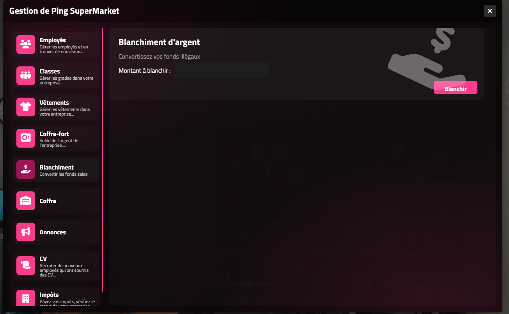

# CLASAM SCRIPTS

# Money Laundering Snippet for VAMES Boss Menu

This script allows **businesses** to **launder black money into clean cash** directly from the VAMES boss menu interface.




## Features

- **Supports multiple frameworks**:  
  - [x] QBCore  
  - [x] QBOX  
  - [x] ESX  

- **Native support for `ox_inventory`**
  - Clean integration with black money items
  - Easily adaptable to any inventory system

- **Gang restriction**
  - Prevents gangs from accessing the laundering feature

-  **Cooldown system**
  - Configurable delay between laundering sessions (default: 12 hours)

- **Customizable laundering percentage**
  - Example: 85% of laundered value is returned as clean cash

---

## What is this?

This is a **code snippet** designed to be embedded into the **VAMES Boss Menu**.  
It adds a secure and easy-to-use money laundering option for legitimate companies on your RP server.

---

## Configuration

You can customize the following in the server-side file:

```lua
local LAUNDER_PERCENTAGE = 0.85          -- 85% clean return
local LAUNDER_COOLDOWN = 43200           -- 12-hour cooldown (in seconds)
